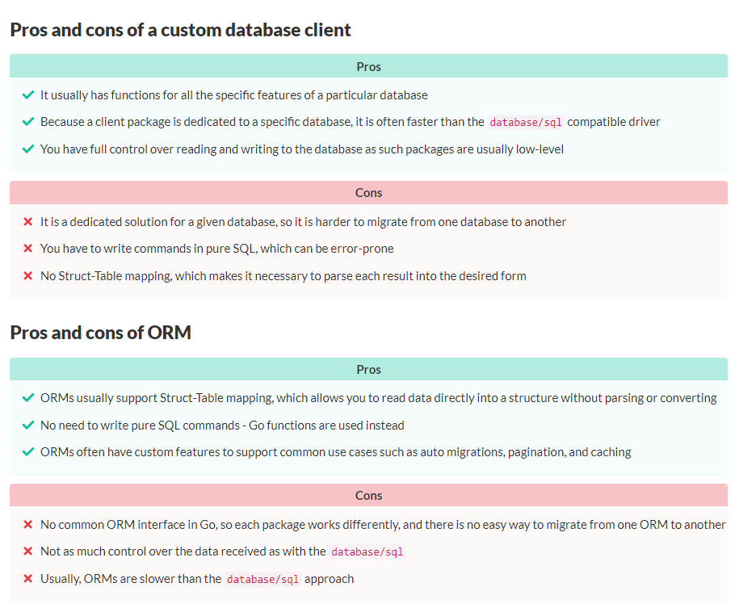

## Important Resources
- [github-postgres-intro](https://github.com/gosamples-dev/samples/tree/main/postgresql-intro)
- [a-pratical-guide](https://gosamples.dev/postgresql-intro/)


<details>
<summary>
Folder structure
</summary>

* website is our domain package. We are going to create a mini ranking of websites, so we will put the Website domain object, the repository definition, and its three implementations here.

* app is the package that will contain the demo procedure of our repository and that will be used by all apps in the cmd directory.

* cmd is a directory that will contain three apps running our repository demo procedure, one for each repository implementation: with the classic database/sql approach, with the pgx database client, and with the GORM ORM.
</details>

<details>
<summary>Rationale</summary> 
## Who is this tutorial for?
This tutorial is suitable for both beginners and advanced programmers who want to learn or remember how to perform basic operations on a PostgreSQL database from within the Go language. However, it does not teach SQL and does not explain in detail how PostgreSQL works. The purpose is to connect and perform operations in a Go application.

It is a tour on how to build a data access layer using clean code practices and what are the popular ways to connect to PostgreSQL. Since we use very simple examples in the tutorial, it is a great introduction to building something more advanced, and we encourage you to come back to it whenever you need to create a data access layer in your new project.

### Table of Contents

- Pure SQL or ORM
- Repository pattern
- Install PostgreSQL
- What we are going to build
- Init project structure
- Domain object and repository
- Repository methods
- Repository errors
- Init classic database/sql repository
- Implement Create method
- Implement reading methods
- Implement Update method
- Implement Delete method
- Init the main function and the demo procedure
- Complete the demo procedure
- Repository based on the pgx client
- Run the demo procedure for pgx-based repository
- GORM repository
- Run the demo procedure for GORM repository
- Summary


## The database/sql package

O Go tem sua propria biblioteca que provê funcionalidades universais para lidar com banco de dados. 
A unica coisa que você precisa se atentar é sobre a existência do driver especifico para o banco que 
você quer acessar. Em outras palavras, um cliente para o banco, feito em Go.

A vantagem de utilizar ```database/sql``` é que é a biblioteca padrão da linguagem(aparentemente tudo que é bom e bem feito, já é assim em Go).

An ORM or other tools

The database/sql package and dedicated clients run at a low level, and not everyone likes this type of work. Especially if the database you want to implement has many tables, **you expect some sort of speedup by not having to write every query by hand. In this case, the best solution would be to use ORM or other tools, such as those that generate code from SQL commands.**

Feature como:
 - automatic migration
 - caching
 - pagination of results
 - and many others.

não vem por default nessa biblioteca.

Nesse estudo de como usar Go e Postgres, vou tentar utilizar 3 abordagem.

 we are going to show you three approaches to creating a database access layer. First, using the pgx PostgreSQL database/sql compatible driver as this is the simplest and most natural approach for Go. Second, using the pgx custom client that offers all the features of PostgreSQL in Go. As a bonus, we will also show you how to create the same functions using GORM ORM.

how import a image in markdown



## Pure gold about repository pattern

> Clean and maintainable projects require the presentation, application, and persistence layers be kept separate from each other. No one likes spaghetti code that mixes bits of direct data retrieval and bits of data processing. In our opinion, only two things are needed to create a clean design in terms of data.
> 
> First of all, the code that retrieves and writes data to the database for a given Domain object should be extracted as a separate service so that there is only one place to access the domain object data in the entire project - the data access layer.
> 
> Second, database implementation details should be hidden behind an abstraction - an interface. This approach keeps the code database-independent and resilient to future changes in the infrastructure, since one database can easily be replaced in the code by another by creating a new implementation of the same interface for a new database. In addition, working on interfaces rather than a specific implementation helps you focus on the domain rather than on how the data is stored.

</details>