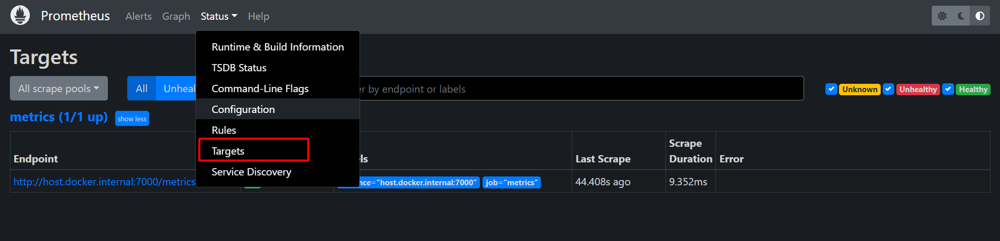

## Briefing
Just a prometheus local setup

## Get started

Expose the metrics for localhost

You can access through the link >>> localhost:7000
```
poetry run python server.py
```

After that, up de docker compose
```
docker-compose -d
```

Access localhost:9090 and verify if your metrics sever are in healthy mode



